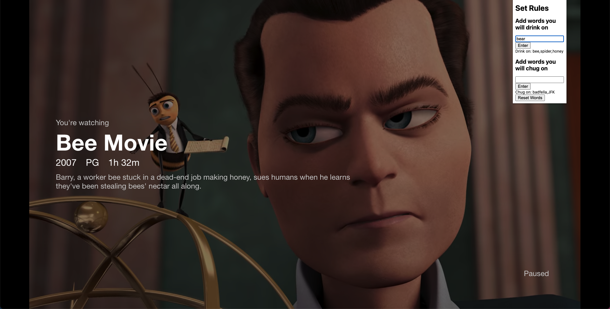
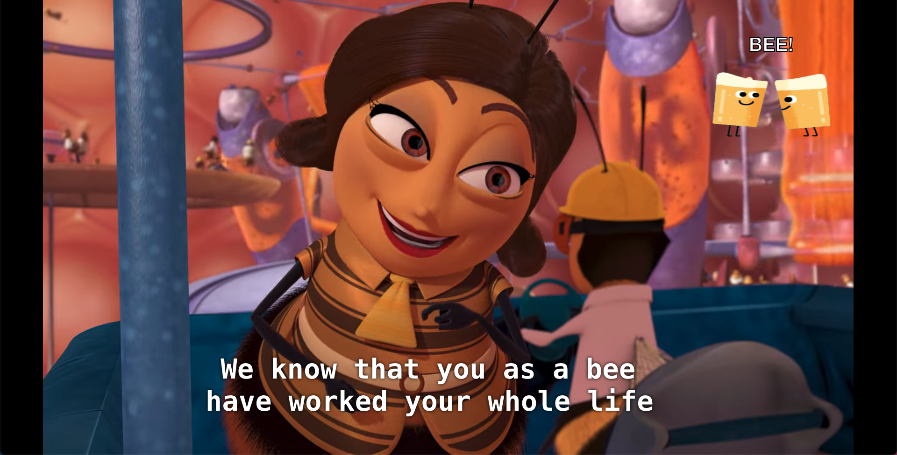

# Plug 'n Chug

Plug 'n Chug is a browser extension for Chrome that allows for fun and easy drinking games to be played using user-chosen words that might appear in Netflix content.

## How to install

1. Download this repo
1. Make sure the files are in an unzipped folder
1. Click 'load unpacked' in the chrome extensions page and choose the folder.

## How to use

First type and click enter for words you want to 'drink' and 'chug' on in the dropdown menu that can be accessed by clicking the extension icon. After entering the words, make sure you refresh the page once before playing your video. You can reset your drinking game at any point by clicking the 'reset words' button and entering a new set of words.

## Plug 'n Chug in action

